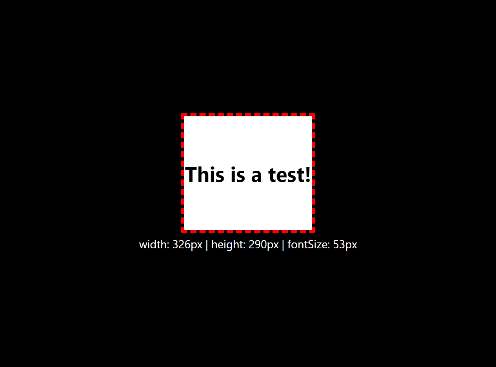

# react-fitmeplz

[](https://twitter.com/NotBaldrick)



## Install

```bash
npm install --save react-fitmeplz
yarn add react-fitmeplz
```

## Usage

```jsx
import React from "react";
import Fitmeplz from "react-fitmeplz";

function Header() {
  return (
    <div style={{width: "100px", height: "300px"}}>
      <Fitmeplz
        min={10}
        max={100}
        start={50}
        throttle={0}
        step={5}
        hideOnMount={true}
        hideOnCalc={true}
        onStart={() => console.log("Calculating optimal font size!")}
        onEnd={() => console.log("Finished calculating optimal font size!")}
        onFontsize={(size) => console.log(`Current font size is: ${size}`)}
      >
        This is a test!
      </Fitmeplz>
    </div>
  );
}

export default Header;
```

## Props

| Name          | Type     | Default  | Description                                                                                                           |
| ------------- | -------- | -------- | --------------------------------------------------------------------------------------------------------------------- |
| `min`         | number   | 1        | Minimum font size in pixels.                                                                                          |
| `max`         | number   | 300      | Maximum font size in pixels.                                                                                          |
| `start`       | number   | 100      | Font size in pixels when the component first mounts.                                                                  |
| `throttle`    | number   | 0        | Throttle (in milliseconds) the rate in which font size is changed and text elements size is compared with its parent. |
| `step`        | number   | 1        | Font size change in pixels when calculating optimal font size.<br>WARNING! A large value may cause infinite loops.    |
| `hideOnMount` | boolean  | true     | Text will be hidden on component mount until font size calculation has finished.                                      |
| `hideOnCalc`  | boolean  | true     | Text will be hidden every time a new font size has to be calculated.                                                  |
| `onStart`     | function | () => {} | Function will be called when font size is calculating.                                                                |
| `onEnd`       | function | () => {} | Function will be called when font size has finished being calculated.                                                 |
| `onFontsize`  | function | () => {} | Function will be called every time the font size changes.<br>Will return the new font size in pixels as a string.     |

## License

MIT © [NotBaldrick](https://github.com/NotBaldrick)
